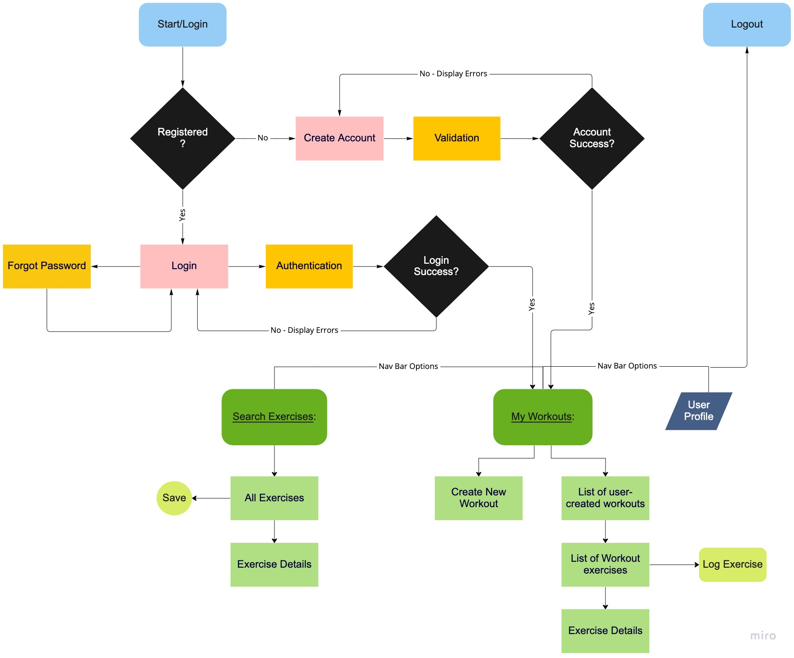
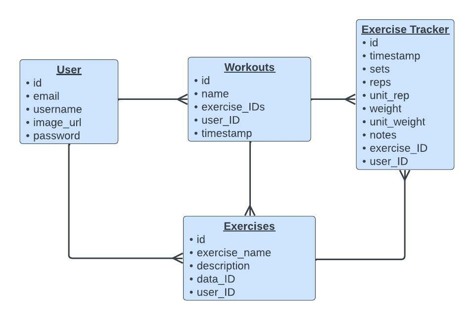

# Capstone1
Title of Project
## GitFit App
https://vrbrag-gitfit-app.herokuapp.com/

API: https://wger.de/api/v2/ 

### Goal
The GitFit application gives gym-goers of all fitness levels a platform to pursue their personal fitness goals. Whether you are a beginner or an expert, users can learn new exercises, create workouts, keep track of workout sets and weights, and discover exercise variations. 

### Demographics
This app is intended for all training experience levels who use gym equipment to achieve their fitness goals. For beginners this app can provide a starting point by introducing them to exercises and demos for how to perform movements properly. On the other hand, those who typically cycle through an existing workout plan can organize their workout cycles, keep track of weights, and even find inspiration to revamp their current plan if they have hit a plateau. 

### Features
Logged in users can view the following features:
  1. Search Exercises - search list of API exercises by name. This uses the API. 
  2. View Exercise - view exercise details, which includes: Description, Equipment, Primary Muscles, and/or Variations. This uses the API.
  3. Save Exercise - save API exercises to the database. Saved exercises are required to create workouts.
  4. New Workout - name and add any number of exercises to create a workout.
  5. Log Exercise - track number of sets, reps, and weight, and make notes for future reference.

### User Flow
Once signed into their account, users are taken directly to the homepage, My Workouts, which displays all their workouts they created. The same page is linked to allow the user to create a new workout. On the Create a New Workout page, users can select from a list of exercises that have been previously saved. If they don’t see the exercise they want, the page is linked to the Search Exercises page. There the user can search by name through the API exercises list and save the ones they like. They can also click on each exercise to view a more detailed description on form, equipment required, muscles the exercise focuses on, and variations to try. 

After the user has created a workout, from the homepage each workout is linked to view its list of exercises where the user can also log their exercise sets. Inside the workout, each exercise displays the user’s latest exercise logs so they know how much weight to add/subtract each gym session. 

### Technology 
This site is built using Python3/Flask/Jinja2

### Data Schema

